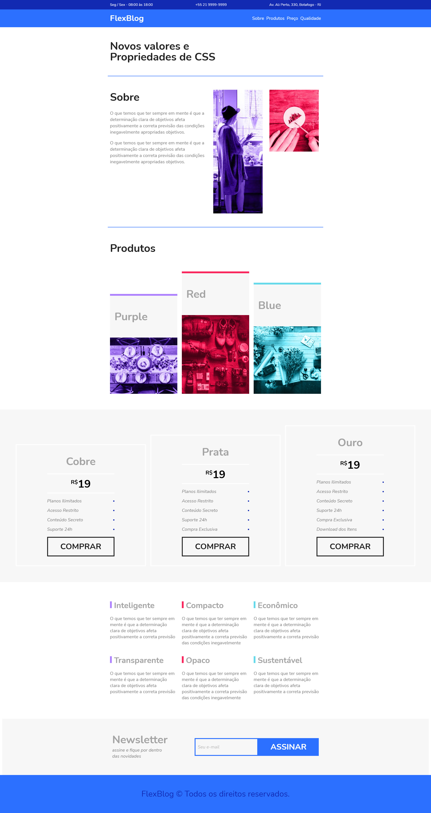

First time coding in 2021 after a bad 2020 end and a bad 2021 biginning
Things starting to get better now, lets move on!!!

----------------------------------------------------------------------------
Creating a static webpage to practice flexbox!

## Adding the final result of the pages on my projects!

 -- https://project-flexblog.netlify.app

